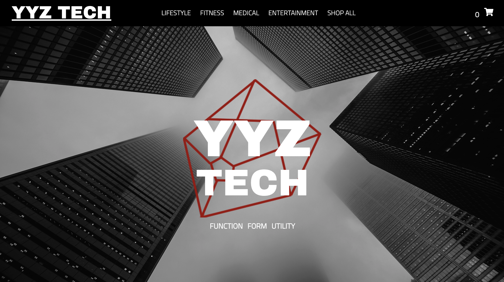
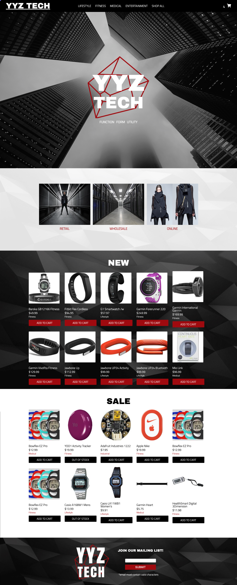
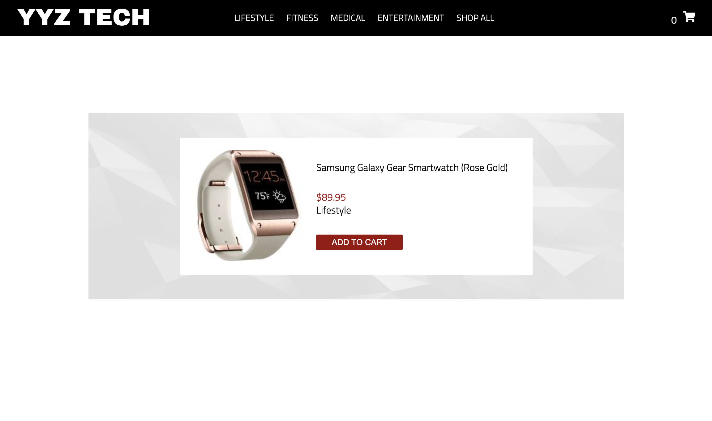
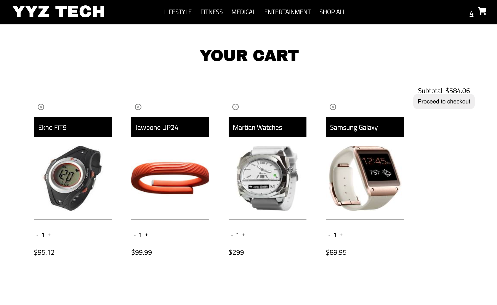
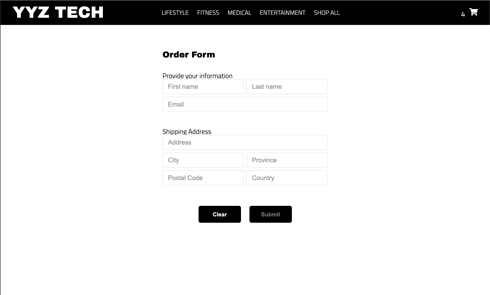

## YYZ TECH - E-Commerce Group Project - Concordia Full-Stack Bootcamp



### Technologies

React / Styled Components / Redux / Node.js / Express

### Goals

Complete a working front and backend E-commerce store with a strong focus on group collaboration, workflow and version control using Git.

### Contributors

Kurumi Kawamura: [https://github.com/kurumi-kawamura](https://github.com/kurumi-kawamura)

Sonitta Phet: [https://github.com/SonittaPhet](https://github.com/SonittaPhet)

Nicholas Deveault: [https://github.com/Nicholasdeveault](https://github.com/Nicholasdeveault)

Cara Giulioni: [https://github.com/caragiulioni](https://github.com/caragiulioni)

### Usage

#### Back-End

```shellscript
cd server

yarn install

yarn start
```

#### Front-End

```shellscript
cd client

yarn install

yarn start
```

### Screenshots

#### Full



#### Item



#### Cart



#### Order Form


